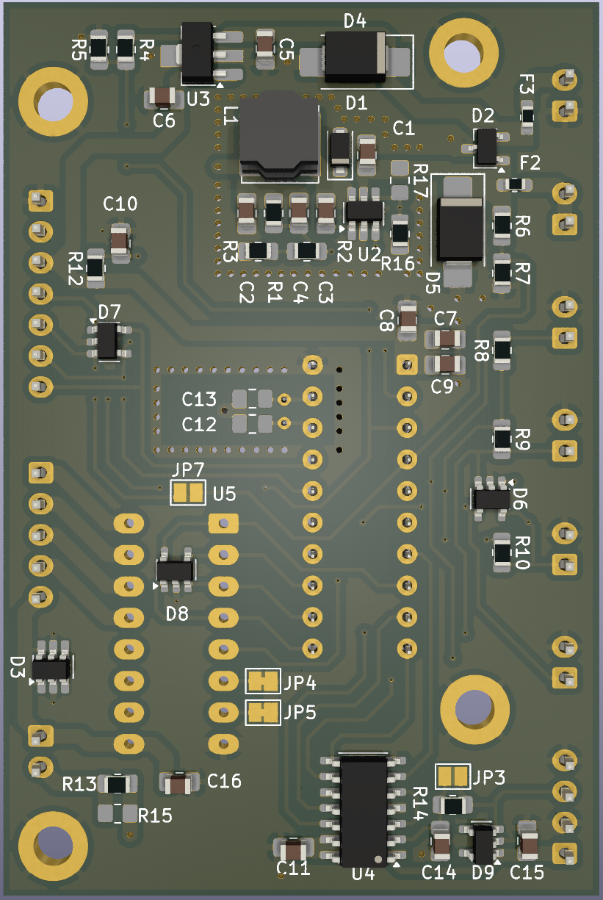
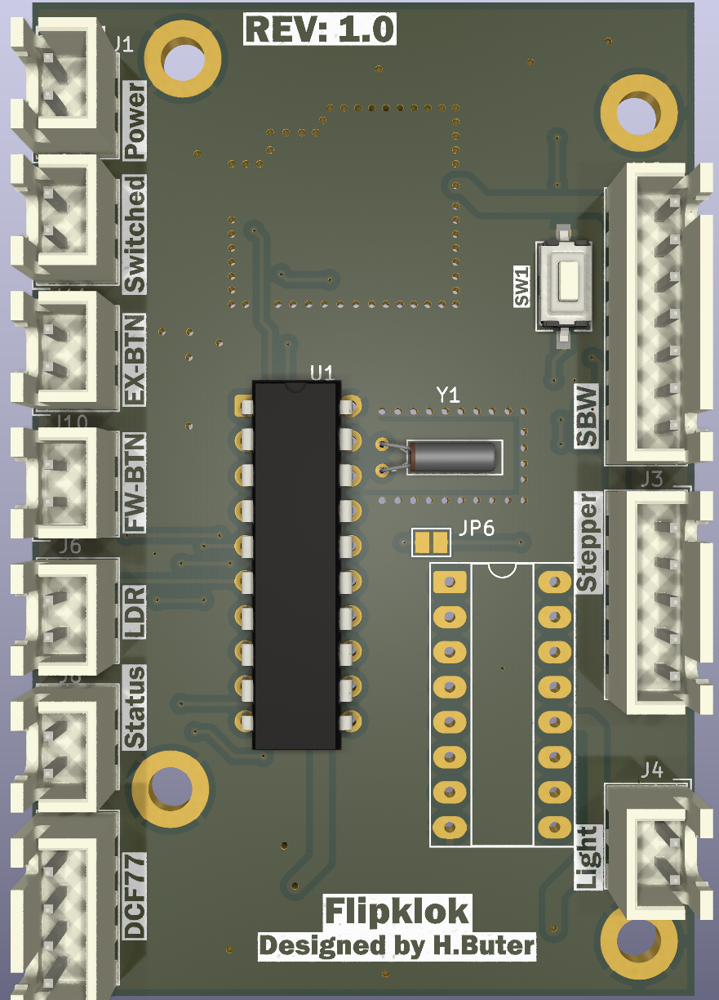

# Flipklok in 1970s Style with DCF77 Time Synchronization

|  |  |
|----------------------------|-----------------------------|
|                        |                        |

Welcome to the repository for my project as part of my Bachelor's degree in Electronics at Windesheim. This
project involves creating a flip clock inspired by the design from the 1970s, which is synchronized using time
information from the DCF77 long-wave time signal. The goal is to ensure that this electronic and electromechanical
device operates efficiently within a low power environment.

At time of writing I am still deciding on if the clock will be used a desk clock or if I build it in to my 1977 Relaint Robin MK1
This is why some design decisions, like low power, are not always directly clear in the scope of a normal clock project.

For the complete documentation see the doxygen documentation hosted on GitHub pages:
- Index: https://h-buter.github.io/Flipklok/index.html
- Start of code: https://h-buter.github.io/Flipklok/main_8c.html 
- Interactive Bill of materials: https://h-buter.github.io/Flipklok/md_extra-docs_2bom.html

## Project Overview

This flip clock project integrates both mechanical components and electronics to display the current time
accurately based on data received from the DCF77 transmitter located in Germany. Designed with energy efficiency
in mind, the clock maintains continuous time tracking to compensate for any potential reception limitations of the
DCF77 signal while minimizing power consumption.

## Key Challenges

- **Mechanical and Time Management**: The project requires careful application of mechanics and efficient time
management techniques to ensure the device functions optimally on a 12V source.

- **Integration of Electronics and Electromechanics**: Incorporating electronic components like motors and sensors
for position detection into the mechanical design poses significant challenges.

- **PCB Design**: The creation of a custom PCB is necessary to accommodate all electronic components while
maintaining compactness and efficiency.

- **DCF77 Protocol Implementation**: Applying the DCF77 protocol ensures accurate time synchronization. This
involves handling signals and data correctly within the system’s constraints.

- **Software Development**: The software component, developed in C with some sections written in assembly
language, is responsible for processing DCF77 data and controlling stepper or servo motors to operate the flip
clock.

## Project Boundaries

### Software
The software aspect focuses on:
- Processing DCF77 signal data.
- Controlling a stepper/servo motor mechanism to display time changes accurately.

### Hardware
The hardware component involves:
- Integrating electronic and electromechanical components for seamless operation of the flip clock module.
- Receiving and processing DCF77 timing information effectively.

## Getting Started

To get started with this project, you need to:

- Code: 
    - If you want to view the code use the doxygen documentation (see intoduction) or view the source files on GitHub.
    - If you want to run the code, install TI code composer studio and clone this repository.
        - This repo should contain every file to be able to compile the code for the MSP430G2553
- PCB:
    - View the PCB files use the exported pdf: [exported pdf's](https://github.com/h-buter/Flipklok/tree/main/PCB/Flipklok/export)
    - Edit the PCB files, Kicad and clone the repo.
    - Run a production:
        - Download the gerber ZIP and give this to you're favorite PCB manufacturer, it may be possible the etch the board you're self but be warned this is not easy because of the multilayer construction.
        - Order the bom
        - Wait for everything to arrive 
        - Assemble
        - Test, don't let the make smoke out (not optional)
            - First power up test
            - Flash the code, i used a launchpad devboard see page 8 till 10 [link to datasheet of launchpad](https://www.ti.com/lit/ug/slau772a/slau772a.pdf?ts=1743585388312&ref_url=https%253A%252F%252Fwww.ti.com%252Ftool%252FMSP-EXP430G2ET%253FkeyMatch%253Dmsp-exp430g2et%2526tisearch%253Duniversal_search)
- Mechanics:
    - To view the 3d files you can use the free viewing program [Edrawings](https://www.edrawingsviewer.com/download-edrawings)
    - To edit the files you will need Solidworks

## Contribution

Contributions are welcome! Whether it's optimizing the code for better performance or suggesting improvements in
hardware integration, your input is valuable.

## License

This project is licensed under to be determined 

---

Thank you for exploring this unique blend of vintage design and electronics. Should you have any questions
or suggestions regarding this project, feel free to open an issue or contact me directly.